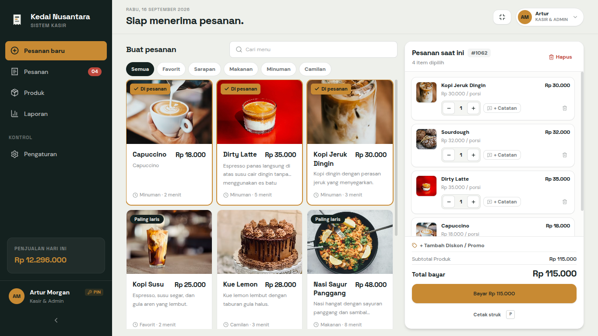
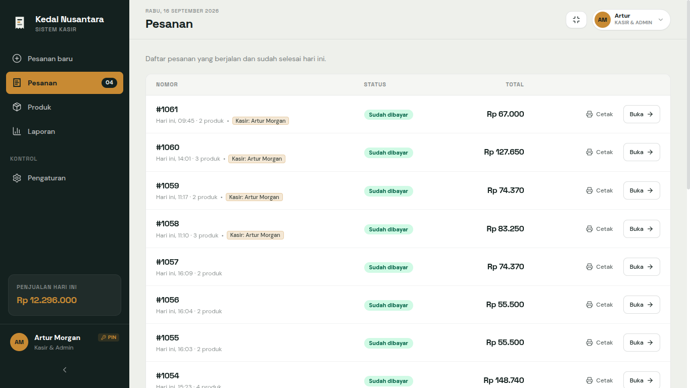
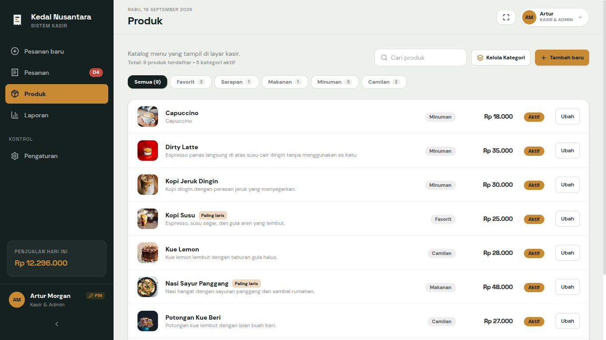
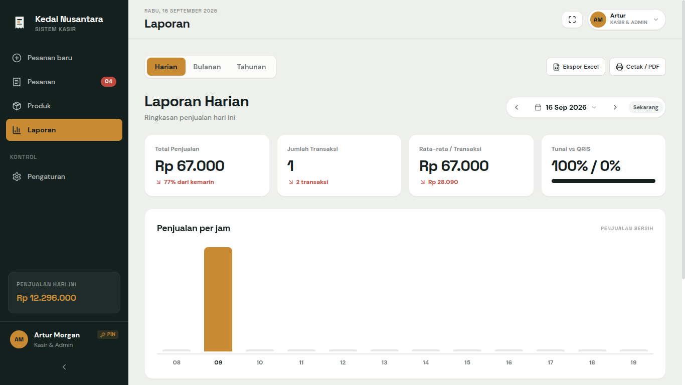
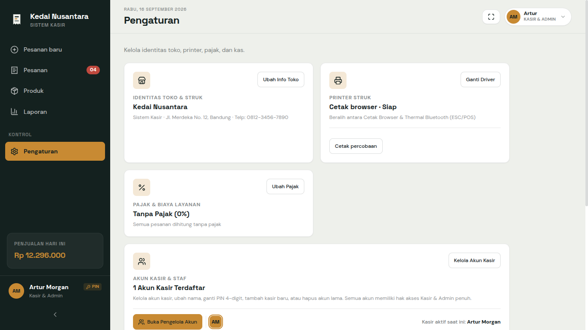
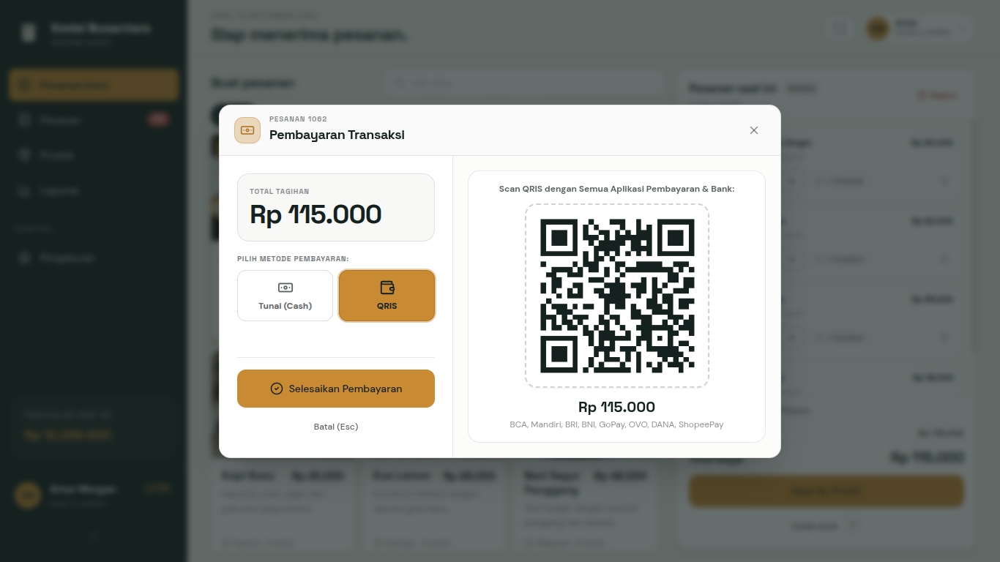
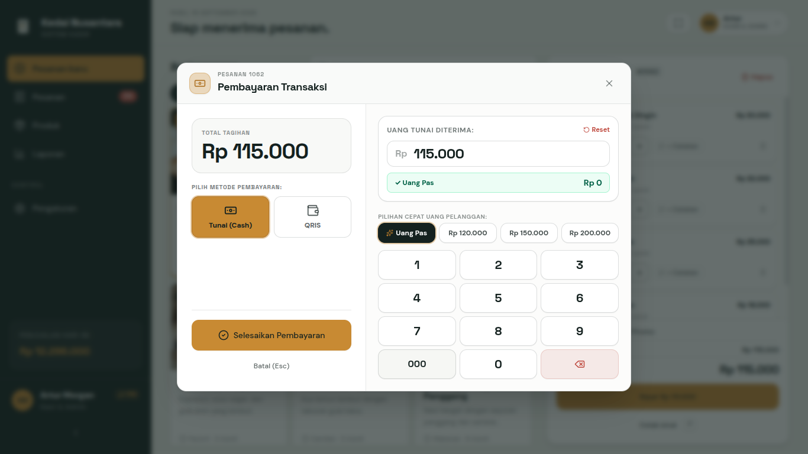

<div align="center">

# 🍽️ POS Kasir — Sistem Kasir & Manajemen Restoran Modern

**Sistem Point of Sale (POS) Kasir, Manajemen Produk, Pemantauan Pesanan, dan Laporan Penjualan Komprehensif (Harian, Bulanan, Tahunan) Offline-First.**

[](https://react.dev/)
[](https://www.typescriptlang.org/)
[](https://vitejs.dev/)
[](https://tailwindcss.com/)
[](https://dexie.com/)
[](https://web.dev/progressive-web-apps/)
[](LICENSE)

<br/>



</div>

---

## 🌟 Ringkasan Keunggulan

POS Kasir dirancang khusus untuk kebutuhan operasional kuliner modern (restoran, cafe, kedai kopi, warung makan, dan bakery) yang mengutamakan **kecepatan transaksi, keandalan tanpa koneksi internet (offline-first), serta laporan analitik penjualan yang akurat dan terperinci**.

- ⚡ **100% Offline-First (Dexie IndexedDB)**: Data transaksi, menu produk, dan riwayat penjualan tersimpan aman di browser lokal. Aplikasi tetap beroperasi penuh meskipun koneksi internet terputus.
- 🚀 **Alur Kasir Cepat & Direct Checkout**: Alur transaksi kasir yang ringkas, responsif, dan bebas hambatan — langsung pilih menu, sesuaikan varian/catatan, hitung diskon & pajak, dan tuntaskan pembayaran.
- 📊 **Laporan Penjualan Komprehensif (Harian, Bulanan, Tahunan)**:
  - **Laporan Harian**: Ringkasan omset hari ini, grafik penjualan per jam (08:00–19:00) dengan penanda jam puncak (*amber peak highlight*), rincian blok waktu (sarapan, siang, santai sore, makan malam), dan item terlaris.
  - **Laporan Bulanan**: Grafik penjualan mingguan (Mg 1–Mg 5), deteksi Hari Terbaik dalam seminggu, rasio transaksi Tunai vs QRIS, dan tabel rincian performa per minggu.
  - **Laporan Tahunan**: Grafik penjualan 12 bulan (Jan–Des) dengan penanda bulan terbaik (*best month*), perbandingan pertumbuhan tahunan, dan rincian transaksi bulanan.
  - **Ekspor Excel & Cetak PDF**: Dukungan ekspor laporan multi-sheet ke Microsoft Excel (`.xlsx`) dan cetak dokumen laporan resmi / PDF.
- 👥 **Manajemen Akun Kasir (CRUD) & Proteksi PIN 4-Digit**:
  - Ganti peran dan kasir bertugas secara instan (*Quick Switch Modal*) tanpa logout sesi.
  - Tambah, ubah, dan hapus akun kasir mandiri lengkap dengan foto avatar dan shift kerja.
  - Nama kasir yang bertugas otomatis tercetak pada struk pembayaran (*receipt*).
- 📦 **Katalog & Manajemen Produk**:
  - Pengelolaan produk makanan dan minuman, harga jual, kategori menu, dan SKU barcode.
  - Pencarian cepat instan (`Ctrl + K`) dan filter kategori interaktif.
- 🖨️ **Pencetakan Struk Thermal & Browser**:
  - Driver printer thermal ESC/POS biner via Web Bluetooth API (58mm & 80mm).
  - Dialog cetak browser (`window.print()`) dengan proteksi cetak bersih tanpa kebocoran elemen UI atau notifikasi.
- 💾 **Pencadangan & Pemulihan Data (Backup & Restore)**:
  - Ekspor/impor cadangan database lengkap (`.json`) serta ekspor katalog produk (`.csv`).

---

## 📸 Galeri Antarmuka

| Modul | Tampilan Antarmuka |
| :--- | :--- |
| **Kasir Utama (POS)**<br/>*Pencarian instan, keranjang interaktif, diskon, QRIS, & cetak struk* |  |
| **Daftar Pesanan**<br/>*Pemantauan pesanan yang sudah dibayar* |  |
| **Katalog & Produk**<br/>*Manajemen menu, penetapan harga, kategori, foto* |  |
| **Laporan Penjualan**<br/>*Grafik penjualan interaktif, rasio Tunai vs QRIS, & ekspor Excel/PDF* |  |
| **Pengaturan & Akun Kasir**<br/>*Kelola nama toko, printer struk, pajak, akun kasir, & backup data* |  |
| **Pembayaran QRIS**<br/>*Kode QRIS statis untuk pembayaran non-tunai langsung* |  |
| **Pembayaran Tunai**<br/>*Kalkulator uang kembalian instan* |  |

---

## 🔑 Manajemen Akun Kasir & Identitas Struk

Sistem dilengkapi fitur pengelolaan kasir mandiri (**CRUD: Tambah, Ubah, Hapus**) dengan proteksi PIN 4 digit:

- **Daftar Kasir Dinamis**: Buka menu **Pengaturan > Akun Kasir & Staf**, lalu kelola nama kasir, PIN 4 digit, keterangan shift, dan warna avatar.
- **Ganti Kasir Cepat (*Quick Switch*)**: Klik tombol profil avatar kasir di pojok kanan atas untuk berpindah kasir bertugas secara instan menggunakan otentikasi PIN.
- **Identitas Otomatis pada Struk**: Setiap pesanan yang dibayar secara otomatis menyematkan nama kasir yang sedang aktif bertugas pada struk cetak browser maupun printer thermal bluetooth ESC/POS.

---

## 🛠️ Fitur & Modul Utama

### 1. 🛒 Kasir & Transaksi POS (`/`)
- **Pencarian Cepat**: Temukan menu dalam hitungan milidetik berdasarkan nama atau SKU barcode.
- **Kustomisasi Pesanan**: Tambahkan catatan khusus per menu (*less sugar, tanpa es, ekstra pedas*).
- **Kalkulasi Otomatis**: Subtotal, diskon (persen maupun nominal), biaya layanan (*Service Charge*), dan Pajak (PPN).
- **Metode Pembayaran Lengkap**: Tunai dengan kalkulator uang kembalian instan, QRIS, Kartu Debit/Kredit, dan Transfer Bank.
- **Penyimpanan Draf Pesanan**: Pesanan dapat disimpan sementara (*hold order*) dan diselesaikan kemudian.

### 2. 📋 Pemantauan Pesanan (`/pesanan`)
- **Daftar Pesanan Real-time**: Melacak seluruh transaksi yang sudah selesai hari ini.
- **Filter Status Pesanan**: Filter cepat berdasarkan status (*Disimpan*, *Siap*, *Sudah Dibayar*).
- **Buka & Selesaikan Pesanan**: Muat kembali pesanan yang tersimpan langsung ke kasir untuk proses pembayaran.

### 3. 📦 Manajemen Katalog & Produk (`/produk`)
- **Manajemen Menu**: Tambah baru, edit data, dan hapus menu makanan atau minuman.
- **Integrasi Barcode**: Tetapkan kode barcode/SKU unik pada setiap menu untuk kemudahan pemindaian dengan scanner gun.
- **Kategori & Foto Kuliner**: Pengelompokan kategori yang rapi serta dukungan foto produk.

### 4. 📈 Laporan Penjualan Analitik (`/laporan`)
- **Tab 1: Laporan Harian**:
  - 4 Kartu KPI: Total Penjualan (+% vs kemarin), Jumlah Transaksi (+transaksi), Rata-rata / Transaksi, dan Rasio Tunai vs QRIS.
  - Grafik Penjualan per Jam (08:00–19:00) dengan sorotan khusus warna emas (*Amber Peak*) pada jam tersibuk.
  - Tabel rincian 4 blok waktu operasional (`08:00–11:00`, `11:00–14:00`, `14:00–17:00`, `17:00–20:00`) lengkap dengan item terlaris dan omzet.
- **Tab 2: Laporan Bulanan**:
  - 4 Kartu KPI: Total Penjualan (+% vs bulan lalu), Jumlah Transaksi, Hari Terbaik (hari dengan omzet tertinggi), dan Rasio Tunai vs QRIS.
  - Grafik Penjualan per Minggu (Mg 1–Mg 5) dengan sorotan minggu tertinggi.
  - Tabel performa mingguan lengkap dengan rata-rata harian.
- **Tab 3: Laporan Tahunan**:
  - 4 Kartu KPI: Total Penjualan (+% vs tahun sebelumnya), Jumlah Transaksi, Bulan Terbaik (*Best Month*), dan Rasio Tunai vs QRIS.
  - Grafik Penjualan 12 Bulan (Januari – Desember) dengan sorotan bulan puncak.
  - Tabel performa tahunan dengan rata-rata per transaksi tiap bulan.
- **Navigasi Periode Fleksibel**: Geser mundur/maju tanggal, bulan, atau tahun, pemilih kalender tanggal langsung, dan tombol kembali ke "Sekarang".
- **Ekspor Excel & Cetak**: Ekspor multi-sheet ke format Microsoft Excel (`.xlsx`) dan cetak laporan PDF rapi.

### 5. ⚙️ Pengaturan Sistem & Toko (`/pengaturan`)
- **Identitas Restoran**: Atur nama restoran, alamat, nomor telepon, dan pesan catatan kaki struk.
- **Pengaturan Pajak & Biaya**: Sesuaikan persentase PPN dan biaya layanan restoran.
- **Uji Coba Printer Struk**: Cek koneksi printer dan lakukan cetak struk percobaan.
- **Cadangan Data (Backup & Restore)**: Unduh salinan data lokal aplikasi (`.json`), ekspor CSV, dan pulihkan data kapan pun dibutuhkan.

---

## 🏗️ Struktur Folder Proyek

```text
├── client/                      # Frontend Aplikasi POS (React 19 + TypeScript + Vite + Tailwind 4)
│   ├── public/                  # Ikon PWA, manifest, favicon
│   └── src/
│       ├── components/          # Komponen UI, Header, Sidebar, CartPanel, BarcodeScanner, Modals
│       │   └── ui/              # Komponen reusable (Button, Input, dll.)
│       ├── data/                # Data seed awal menu makanan & minuman
│       ├── lib/                 # Database Dexie.js (IndexedDB), Engine Laporan (reports.ts), Exporters
│       ├── locales/             # Kamus bahasa & pelokalan teks sistem
│       └── pages/               # Halaman utama aplikasi:
│           ├── Home.tsx         # POS Kasir Utama
│           ├── Orders.tsx       # Daftar & Manajemen Pesanan
│           ├── Products.tsx     # Katalog & Pengelolaan Produk
│           ├── Reports.tsx      # Laporan Penjualan (Harian, Bulanan, Tahunan)
│           └── Settings.tsx     # Pengaturan Toko, Kasir, & Printer
├── docs/                        # Dokumentasi visual & gambar tangkapan layar antarmuka
└── package.json                 # Skrip otomasi root proyek (dev, build, check)
```

---

## 🚀 Panduan Instalasi & Menjalankan

### Kebutuhan Sistem
- **Node.js**: versi 18.0.0 atau lebih baru
- **Package Manager**: `npm`, `pnpm`, atau `yarn`
- **Browser**: Google Chrome, Microsoft Edge, atau browser berbasis Chromium (disarankan untuk Web Bluetooth & Barcode Scanner API).

### 1. Clone Repository
```bash
git clone https://github.com/raffli0/POS-Kasir
cd POS-Kasir
```

### 2. Pasang Dependensi
```bash
cd client
npm install
```

### 3. Jalankan Aplikasi (Development Mode)
Dari folder utama proyek, Anda dapat langsung menjalankan:
```bash
npm run dev
```
*(Atau `npm run dev` dari dalam folder `client`).*

Aplikasi kasir akan aktif dan dapat diakses di:
👉 **`http://localhost:5173`**

### 4. Pemeriksaan Tipe & Validasi Kode
```bash
npm run check
```

### 5. Kompilasi untuk Produksi (Production Build)
```bash
npm run build
```
Hasil build statis beserta Service Worker PWA siap di-deploy pada folder `client/dist`.

---

## 🧪 Pintasan Keyboard Kasir (Shortcuts)

| Tombol | Aksi |
| :--- | :--- |
| `Ctrl + K` / `Cmd + K` | Buka pencarian instan produk menu |
| `Escape` | Tutup modal / popup yang sedang aktif |
| `F11` | Beralih mode layar penuh (*Fullscreen POS*) |

---

## 📄 Lisensi

Proyek ini dilisensikan di bawah lisensi **MIT License** — bebas digunakan dan dikembangkan untuk keperluan komersial maupun pribadi.
